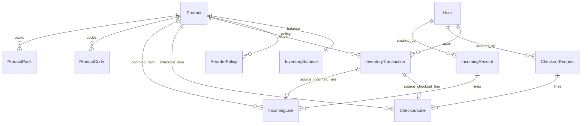

# Data Model & ERD

## Entities
- **User** (Admin, Inventory Manager, Technician) with role enum and optional location.
- **Setting**: key/value (e.g., technician self-checkout toggle, QR prefix).
- **Product**: EPA reg #, name, description, category, unit metadata (base unit type mass/volume/count), reorder thresholds, lead time, default conversion factors (tracking, checkout, ordering to base), default tracking/check-out/order unit labels, pack sizes.
- **ProductPack**: ties ordering unit/pack size to product; supports QR payload `MGPC:pack:<packId>`.
- **ProductCode**: QR or barcode values bound to product/pack.
- **InventoryBalance**: materialized on-hand snapshot in base units for quick reads (derived from ledger).
- **InventoryTransaction**: immutable ledger (types: `initial_load`, `receiving_posted`, `checkout_requested`, `checkout_finalized`, `adjustment`, `audit_count`, `checkin_return`, `transfer`). Stores before/after, who, device, role, idempotency key, reference to source table.
- **IncomingReceipt** + **IncomingLine**: staging for receiving (incoming sheet). Status draft/posted; posting creates ledger rows (`receiving_posted`). Includes backorder quantity.
- **CheckoutRequest** + **CheckoutLine**: maps to checkout sheet (Date, Tech, Product, Qty, Total). Holds `totalBaseQuantity` derived from product unit metadata. Status requested/approved/ready/issued.
- **Notification**: in-app queue and email audit.
- **ReasonCode**: for adjustments/deviations.
- **ReorderPolicy**: optional overrides per product (par level, target days of supply, supplier, lead time).

## ERD (Mermaid)

## Prisma Schema (excerpt)
See [`backend/prisma/schema.prisma`](../backend/prisma/schema.prisma) for the full schema aligned to the spreadsheet mapping and ledger rules.
